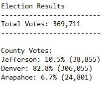
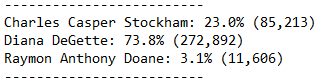
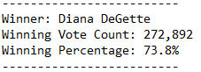

# Election Analysis

## Overview of Election Audit

### Purpose of Election Audit Analysis

The audit was conducted for the Colorado Board of Elections to prepare analysis of election results: report the total number of votes cast, total number of votes and percentage of votes for each candidate, report the winner of the election based on popular vote.

### Purpose of using Python

Election Audit was performed using Python as this code performs calculations quickly; it can handle huge volumes of data easier, faster and without end-user writing formulas, compared to Excel.

The only resource that we need for this automatic analysis - is the final election results file that Python will read and prepare an audit results.

Also Python code is much easier to write compared to VBA and it is more user-friendly.

## Election-Audit Results

- There were 369,711 votes cast in this congressional election;
- Three counties took part in the election:
    1. Jefferson,
    2. Denver,
    3. Arapahoe.
    
    Below is a breakdown of the number of votes and the percentage of total votes for each county in the precinct:

&nbsp;&nbsp;&nbsp;&nbsp;&nbsp;&nbsp;&nbsp;&nbsp;&nbsp;&nbsp;&nbsp;&nbsp;&nbsp;&nbsp;&nbsp;&nbsp;&nbsp;&nbsp;&nbsp;&nbsp;&nbsp;&nbsp;&nbsp;&nbsp;&nbsp;&nbsp;&nbsp;&nbsp;&nbsp;&nbsp;&nbsp;&nbsp;

- As per above breakdown it is obvious that Denver county had the largest number of votes, this information is also provided in the election analysis text file:

&nbsp;&nbsp;&nbsp;&nbsp;&nbsp;&nbsp;&nbsp;&nbsp;&nbsp;&nbsp;&nbsp;&nbsp;&nbsp;&nbsp;&nbsp;&nbsp;&nbsp;&nbsp;&nbsp;&nbsp;&nbsp;&nbsp;&nbsp;&nbsp;&nbsp;&nbsp;&nbsp;

- There were three candidates participated in the election:
    1. Charles Casper Stockham,
    2. Diana DeGette,
    3. Raymon Anthony Doane.
    
    Below is a breakdown of the number of votes and the percentage of the total votes for each candidate:

&nbsp;&nbsp;&nbsp;&nbsp;&nbsp;&nbsp;&nbsp;&nbsp;&nbsp;&nbsp;&nbsp;&nbsp;&nbsp;&nbsp;&nbsp;&nbsp;&nbsp;&nbsp;

- As per above breakdown it is obvious that Diana DeGette won, below is her summary results:

&nbsp;&nbsp;&nbsp;&nbsp;&nbsp;&nbsp;&nbsp;&nbsp;&nbsp;&nbsp;&nbsp;&nbsp;&nbsp;&nbsp;&nbsp;&nbsp;&nbsp;&nbsp;&nbsp;&nbsp;&nbsp;&nbsp;&nbsp;&nbsp;&nbsp;&nbsp;&nbsp;&nbsp;&nbsp;&nbsp;

## Election-Audit Summary

The script that we used in this election audit analysis can be used in any elecction with some modifications - not only for other congressional districts but also for senatorial or local elections.

Modifications depend on how the resource will be changed from the current one. As of now Python code is checking data based on three columns of the election_results.csv file - ballot ID, County and Candidate. There is no limitation in quantity of rows of the report.

### No changes in the structure of the Resources file

For example, for Senate election results we can change Counties to States. Python will still run the analysis correctly no matter if there will be 53 states instead of only three counties. In this case it is very useful to have Winner Candidate Summary because results won't be so obvious for Senate elections vs for elections in only one district with very few counties. For local elections the code can look through Cities. In any case it is enough to make very few adjustments to the variables names and the printed text.

Below is an example of one adjustment:

```
election_results_distr = (
    f"\nElection Results\n"
    f"-------------------------\n"
    f"Total Votes: {total_votes:,}\n"
    f"-------------------------\n\n"
    f"County Votes:\n")
print(election_results_distr, end="")

election_results_senate = (
    f"\nElection Results\n"
    f"-------------------------\n"
    f"Total Votes: {total_votes:,}\n"
    f"-------------------------\n\n"
    f"State Votes:\n")
print(election_results_senate, end="")
```

### Adding more columns to the Resources file

Adding more columns to the resource file can improve analysis and make it deeper. This will require a little bit more modifications. More columns will give us at least:
- new variables while going through rows usign `for` loop;
- new `if` statements to create new lists;
- new key-value pairs in the dictionaries.

For example, adding data about candidate's party affiliation, demographic features can help to understand the link between people's votes, their interests in candidates and predict the winning candidate.